# Ising-Model
This is the simulation code of 2D [Ising Model](https://en.wikipedia.org/wiki/Ising_model), the main algorithms used are Monte Carlo Method and Metropolis Algorithm.  which simply is simulate a 2D lattice of spins that can take two values: up and down, and the total average magnet moment attached to the spins give rise to the magnetic property of the material.

According to theoretical solutions, the critical temperature TC = 2.269J, and the system behaviors differently when T < TC, T ~ TC and T > TC, and those situations are veritied by the simulation code.

## 1. T < TC
when the temperature T is smaller than TC, there will be spontaneous symmetry breaking and the spin of the material aligns automatically, and this give explanation to the nature of magnetism of some material.

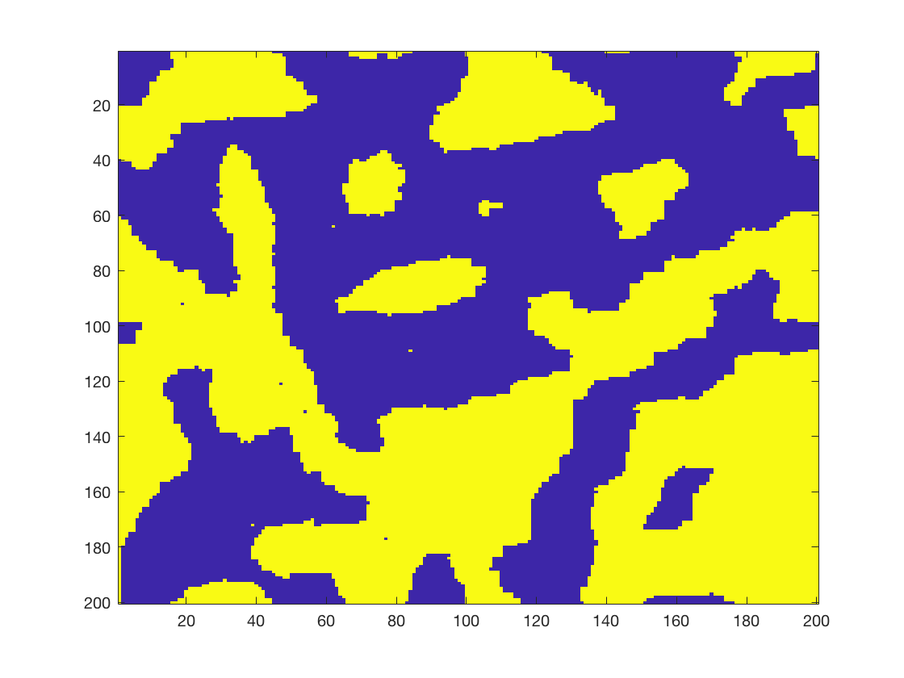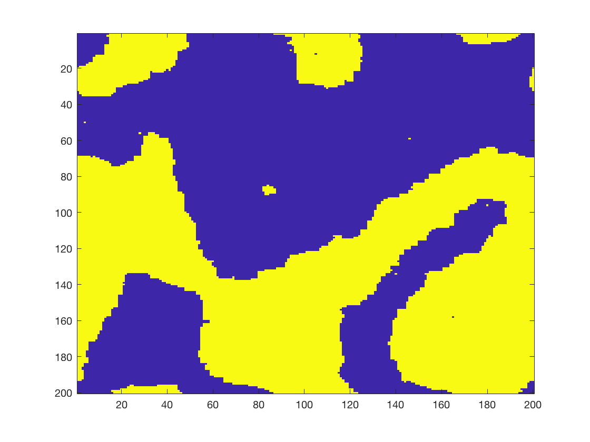
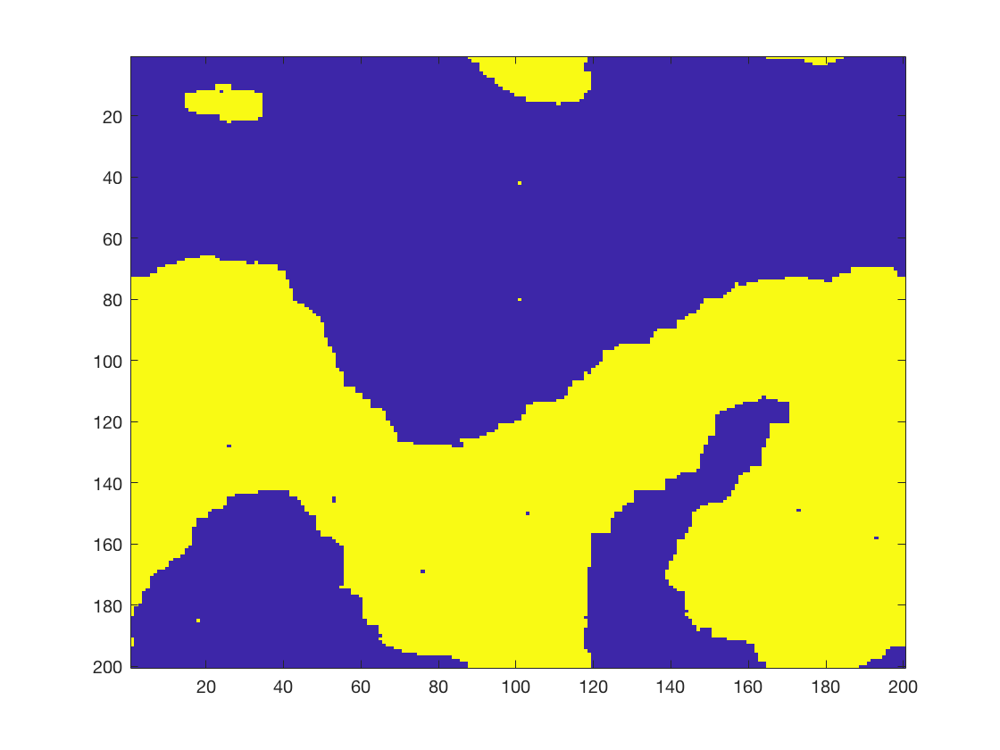
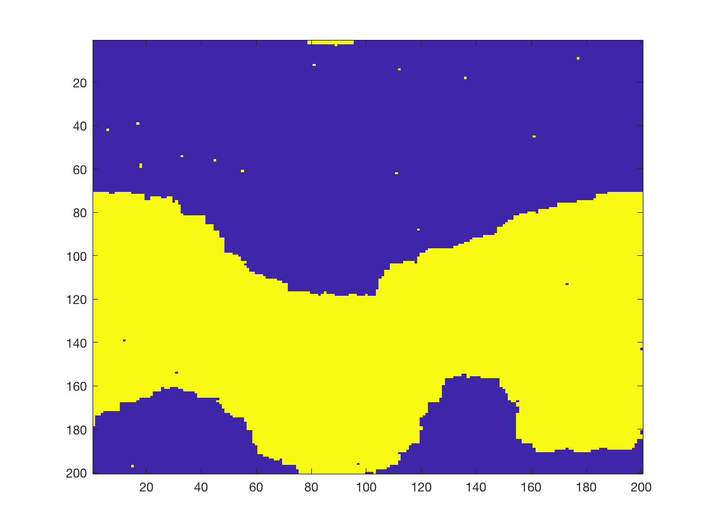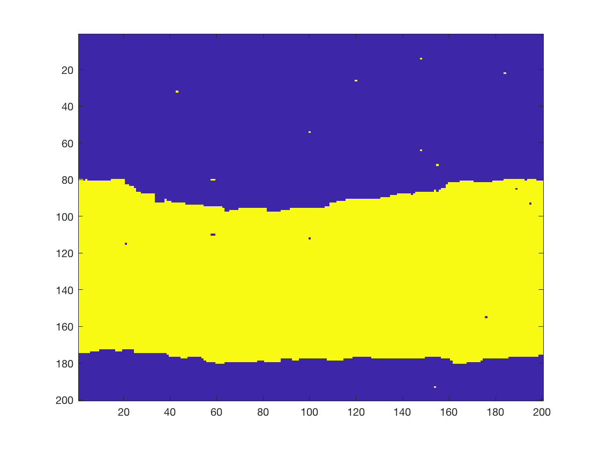

The reason sometimes it is two strips rather than a uniform area is that here I adopt periodic boundary condition and the simulation area is limited. 

## 2. T ~ TC
When the temperature T is very near TC, the correlation between different areas increases, and the correlation length goes to infinity. Because the simulation size is limited, so the media will keep changing and not converge to uniform or completely random.

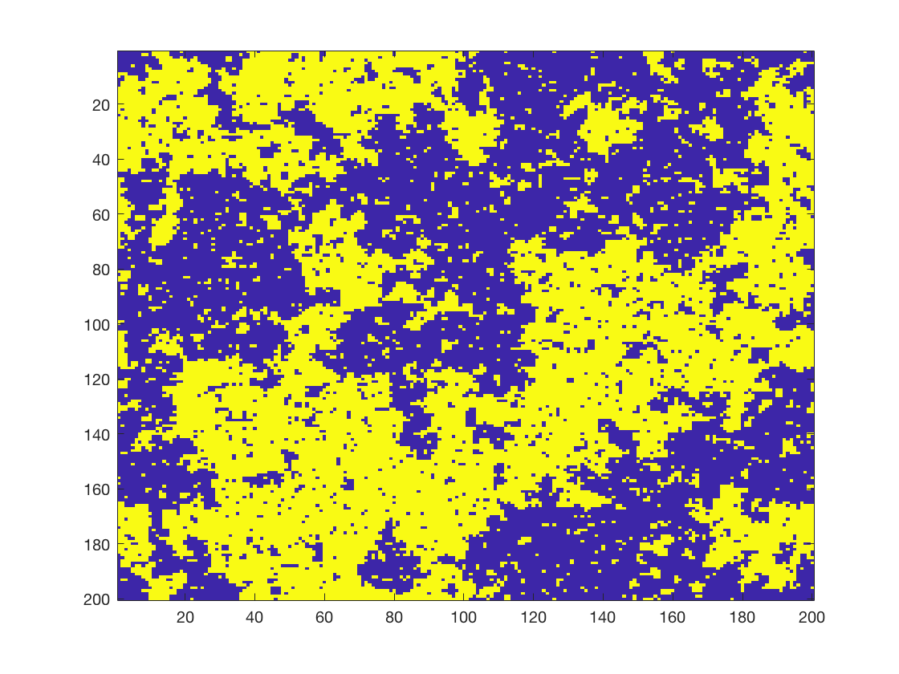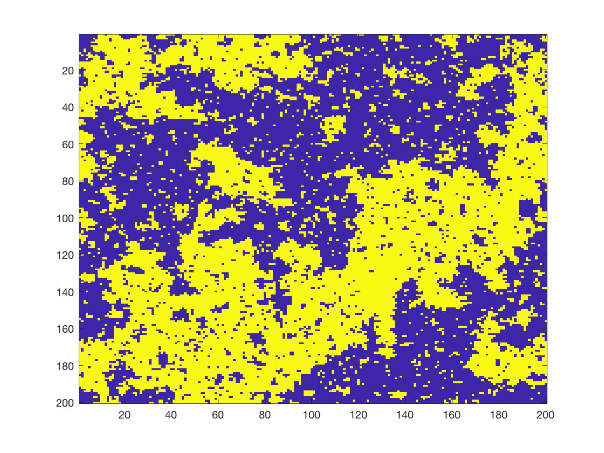
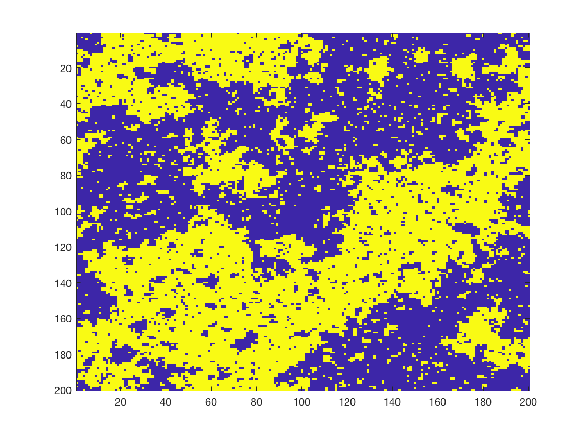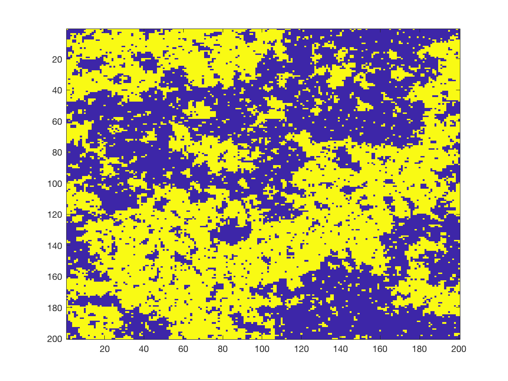

## 3. T > TC
When the temperature T is greater than TC, the spins will point randomly, and the average magnetic moment is zero, this explains the phenomenon that magnetic materials loses their magnetism in high temperature.

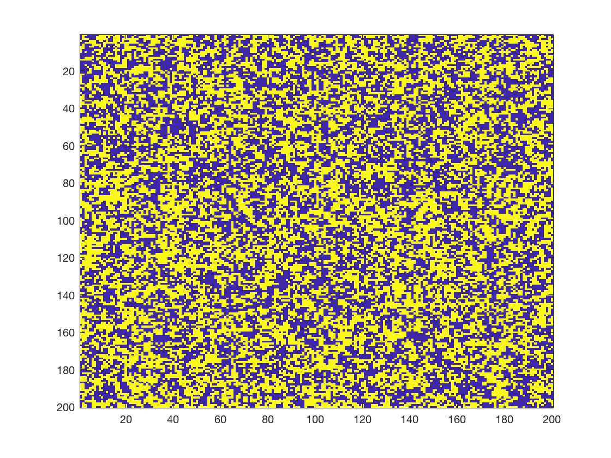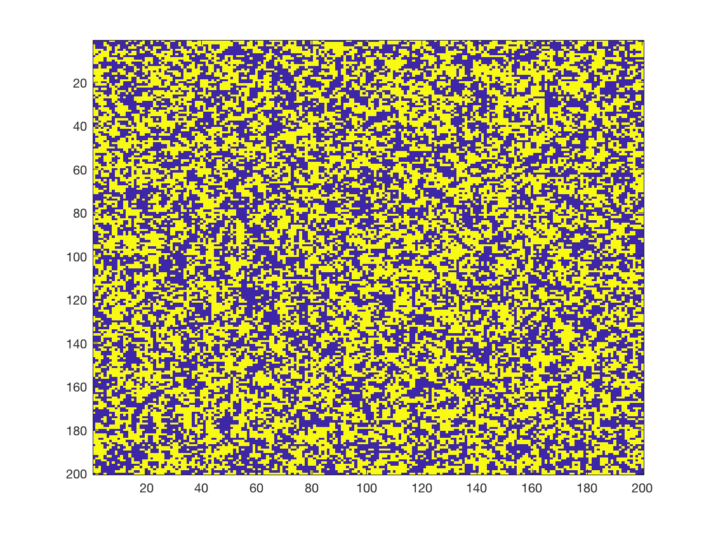
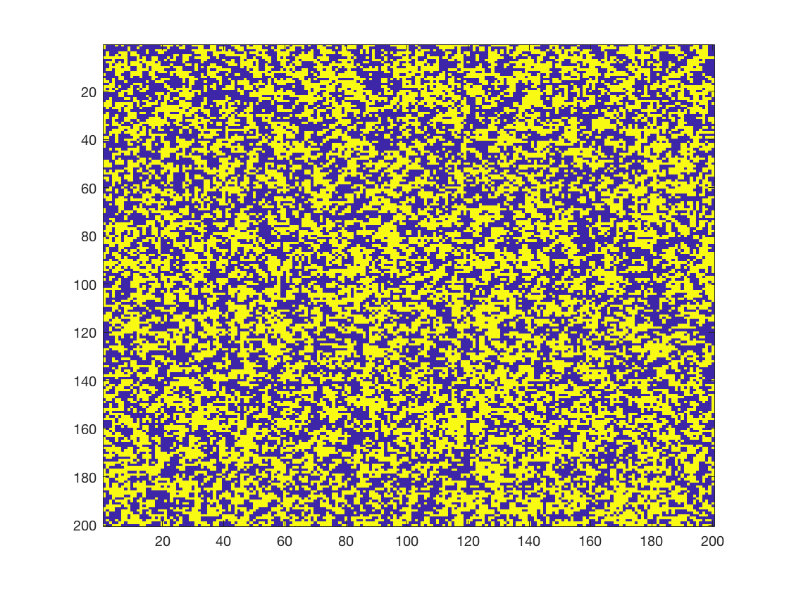

# Reference
The book of reference is "Monte Carlo Methods in Statistical Physics, M. E. J. Newman and G. T. Barkema", chapter 1-4.

